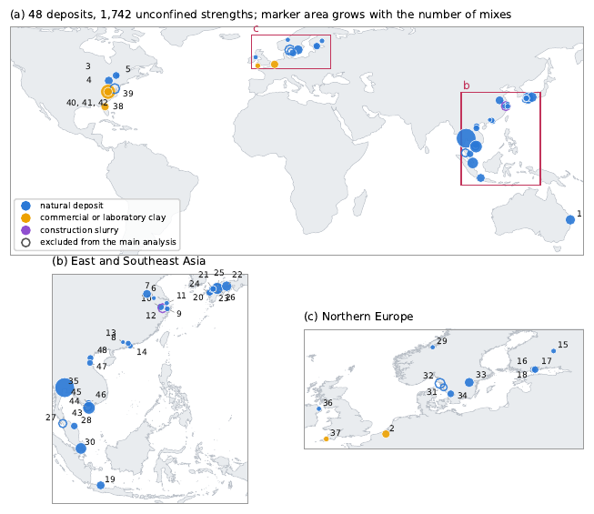

# soilcement

**Predict the unconfined compressive strength of cement-admixed clay from its Atterberg limits and a few trial mixes, using a worldwide corpus of 38 clay deposits as context.**

This repository holds the data, the fitted models and a command-line tool from the paper

> Youwai S., Jongpradist P. *Predicting the strength of cement-admixed clay from a few trial mixes using a worldwide corpus of 38 clay deposits.* (submitted)

A deep-mixing project usually affords only a handful of laboratory trial mixes on its own clay. `soilcement` takes those trial mixes, the liquid limit and plasticity index of the clay, and the corpus of 1,372 published mixes. It then predicts the laboratory strength of every other mix you plan to use, with an 80 % interval. Nothing is trained on your project: the trial mixes are added to the corpus as context and the prediction is a single forward pass.

## What the paper found

Every deposit of the corpus was held out in turn and predicted from k of its own mixes. The table gives mean / median absolute percentage error on the 26 deposits that can be scored at every k.

| Trial mixes | Hierarchical law | TabICL v2 | Use for |
|---:|---:|---:|:--|
| 0 | **78 / 45** | 116 / 58 | feasibility only |
| 1 | **60 / 33** | 74 / 39 | feasibility only |
| 3 | 56 / 30 | **45 / 25** | preliminary design |
| 8 | 48 / 28 | **30 / 17** | design |
| 12 | 52 / 29 | **30 / 16** | design (no gain over 8) |

- **Three trial mixes are the minimum, and eight are enough.** Twelve bring no further gain.
- **With none or one trial mix, use the hierarchical law.** From two or three trial mixes on, use a tabular foundation model (TabICL or TabPFN). `--model auto` makes this choice for you.
- **With eight trial mixes, a prediction typically misses the laboratory strength by a factor of about 1.3.** That is less than the scatter of field strength in deep-mixed ground.
- **The corpus is worth about ten trial mixes.** Fitting a strength law to eight trial mixes alone gives 57 % error, against 28 to 30 % with the corpus.
- **A tuned XGBoost does much worse with trial mixes.** It reaches 45 % with eight mixes, because a tree ensemble cannot weight a handful of new rows the way an in-context learner does.

The errors hold for clays like those of the corpus: marine, estuarine, lake and laboratory clays with liquid limits of 32 to 150 % and Portland-based binders. Peats, organic soils and unusual binders lie outside it and need more trial mixes.

## The corpus



The models predict a new clay by comparing it with the mixes of other clays. Those mixes come from a worldwide literature corpus of cement-admixed clay at water contents near or above the liquid limit, the material of deep mixing. Every result carries its water content and binder content in per cent of dry clay, its binder, its curing time, the Atterberg limits of its base clay and its unconfined compressive strength.

- **Where the numbers come from.** Every value was recovered from a published table, from the text, or digitised from a vector figure. No value was read from a raster image. Each row keeps its source, and the 40 sources of the main set are listed in [`data/sources.csv`](data/sources.csv).
- **Main set.** [`data/corpus_main.csv`](data/corpus_main.csv) holds 1,372 mixes from 38 deposits in 15 countries, counting Hong Kong with China. They come from 40 sources and 31 laboratories, with replicates averaged. This is the set the paper and the tool use.
- **Full set.** [`data/corpus_all.csv`](data/corpus_all.csv) holds all 1,634 averaged results from 48 deposits. The `in_main_set` column marks the main set. The rows left out of it are sand-added blends, peats and organic soils, construction-waste slurry, compacted silt, and vane strengths below 15 kPa, which are too small to score as a percentage error.
- **Data dictionary.** [`data/README.md`](data/README.md) describes every column.

| | 5th percentile | median | 95th percentile |
|:--|--:|--:|--:|
| liquid limit (%) | 35 | 70 | 119 |
| water content at mixing (% of dry clay) | 48 | 100 | 215 |
| equivalent cement content (% of dry clay) | 4 | 25 | 63 |
| curing time (days) | 2 | 28 | 180 |
| unconfined strength (kPa) | 32 | 567 | 3,923 |

| Country | Deposits | Mixes |
|:--|--:|--:|
| Thailand | 1 | 284 |
| USA | 3 | 213 |
| Japan | 5 | 206 |
| Vietnam | 5 | 180 |
| China, including Hong Kong | 8 | 106 |
| Canada | 3 | 68 |
| Australia | 1 | 60 |
| Sweden | 2 | 58 |
| Singapore | 1 | 58 |
| Indonesia | 1 | 40 |
| Finland | 3 | 39 |
| Malaysia | 1 | 25 |
| Belgium | 1 | 18 |
| UK | 2 | 14 |
| Norway | 1 | 3 |

The corpus is heterogeneous, and that limits what any model can do:

- **Laboratories and protocols.** It combines 31 laboratories with their own specimen sizes, curing conditions and mixing procedures, most of which the sources do not report.
- **Vane strengths.** 44 of its strengths are laboratory-vane values on very soft mixes.
- **Binders.** These range from Portland cement alone (76 % of mixes) through composite and slag cements to blends with fly ash and rice-husk ash.

Within one deposit, the strength law leaves a scatter of about 0.5 in ln q_u. This, with the differences between laboratories, sets the floor of about 16 % median error that no model goes below with eight trial mixes.

To add your own data, append rows to `data/corpus_main.csv` in the same columns and reinstall. In-context models use every row as context, so new clays improve the predictions for clays like them.

## Installation

Python 3.9 or later.

```bash
git clone https://github.com/Sompote/SoilCement.git
cd SoilCement
git lfs pull                      # fetches models/tabicl_soil.ckpt (114 MB); needs Git LFS
pip install -e ".[tabicl]"        # law + TabICL (recommended)
```

| Install | Gives |
|:--|:--|
| `pip install -e .` | the hierarchical law only (numpy, pandas, scipy) |
| `pip install -e ".[tabicl]"` | + TabICL v2, released or pretrained on the soil prior (PyTorch) |
| `pip install -e ".[tabpfn]"` | + TabPFN 3 (PyTorch 2.5 or later; the checkpoint downloads from Hugging Face on first use) |
| `pip install -e ".[all,dev]"` | everything, plus pytest |

The first TabICL run downloads the released TabICL v2 weights, which are cached afterwards. A CPU is enough: one prediction takes about a minute on a laptop processor and seconds on a GPU (`--device cuda`). On Intel Macs, PyTorch stops at 2.2, which needs NumPy below 2; the `tabicl` extra pins this automatically on that platform.

Check the installation:

```bash
soilcement --version
pytest -q tests
```

## Usage

### 1. Prepare two CSV files

**Trial mixes** (`--trials`): mixes you have tested.

| column | meaning |
|:--|:--|
| `water_content_pct` | water content at mixing, % of dry clay (natural water plus any added water) |
| `binder_pct` | binder content, % of dry clay |
| `curing_days` | curing time, days |
| `qu_kPa` | measured unconfined compressive strength, kPa |
| `binder` *(optional)* | `opc` (Portland cement, default), `pcc` (Portland composite cement) or `slag` (blast-furnace slag cement) |
| `pozzolan_pct_of_cement` *(optional)* | fly ash, rice-husk ash or other pozzolan, % of the cement (default 0) |

**Query mixes** (`--query`): the same columns without `qu_kPa`. Any extra column, such as a measured value for checking, is passed through to the output.

The binder is reduced to one equivalent cement content, A_c = λ × binder × (1 + 0.75 × pozzolan / 100). Here λ is 1 for `opc` and `pcc` and 1.72 for `slag`. These are the factors used in the paper.

### 2. Predict

```bash
soilcement predict --ll 74 --pi 37 \
    --trials examples/singapore_trials.csv \
    --query  examples/singapore_query.csv \
    --out pred.csv
```

`--ll` and `--pi` are the liquid limit and plasticity index of the project clay, in %. The output adds `qu_pred_kPa` and the 10th and 90th percentiles `qu_p10_kPa` and `qu_p90_kPa`. Its first line states the model used and the benchmark error to expect for that number of trial mixes.

Choose the model with `--model`:

| `--model` | model |
|:--|:--|
| `auto` (default) | law with 0 or 1 trial mix, TabICL from 2 |
| `law` | hierarchical Bayesian strength law, with an exact posterior over the clay's held-water share and strength offset |
| `tabicl` | TabICL v2 as released |
| `tabicl-soil` | TabICL v2 pretrained further on synthetic soil-cement tables; needs `--checkpoint models/tabicl_soil.ckpt` |
| `tabpfn3` | TabPFN 3 as released |

TabPFN 3, TabICL and TabICL with the soil prior were statistically equivalent in the paper, so any of them can be used from three trial mixes on.

With no trial mix, omit `--trials`. The law then gives the zero-shot prediction from the Atterberg limits and its interval:

```bash
soilcement predict --ll 74 --pi 37 --query examples/singapore_query.csv
```

### 3. Find the binder content for a target strength

```bash
soilcement design --ll 74 --pi 37 --trials examples/singapore_trials.csv \
    --target 800 --water 120 --curing 28 --binder opc --table
```

This reports the lowest binder content whose predicted strength reaches the target. It also gives a cautious value at which the 10th percentile reaches it. The prediction is a **laboratory** strength, so apply the field-to-laboratory strength ratio of your design practice.

### 4. Test on a corpus clay

`--exclude-deposit NAME` removes a deposit of the corpus from the context, so the tool can be checked the way the paper did. The example files hold three trial mixes and 31 further mixes of Singapore marine clay from Yao et al. (2020):

```bash
soilcement predict --ll 74 --pi 37 --model tabicl \
    --trials examples/singapore_trials.csv --query examples/singapore_query.csv \
    --exclude-deposit "Singapore marine clay" --out pred.csv
```

On this clay, TabICL gives a mean error of 18 % against the measured values, with every measured strength inside the 80 % interval. `examples/run_examples.sh` runs all the examples.

### 5. The corpus

```bash
soilcement corpus                      # summary by deposit
soilcement corpus --export corpus.csv  # the 1,372 mixes
```

## How to plan the trial mixes

1. **Run three trial mixes spread over the planned ranges.** Use a low and a high cement content, two water contents and two curing times. Predict, and read the cement content needed for the target.
2. **Run three to five more mixes around that cement content.** That brings the total to the eight the benchmark finds sufficient, placed where the design decision is made.
3. **Test the trial mixes in the laboratory, and with the procedure, that will test the quality-control specimens.** The trial mixes carry that laboratory's offset into the prediction.

## Repository contents

| path | contents |
|:--|:--|
| `src/soilcement/` | the package: corpus, hierarchical law, in-context models, command-line tool |
| `src/soilcement/data/law_constants.json` | the law's constants fitted to the 1,372 mixes |
| `data/corpus_main.csv` | the 1,372 mixes of the main set: 38 deposits, 40 sources, 31 laboratories |
| `data/corpus_all.csv` | all 1,634 averaged results, including the sets excluded from the main analysis, with the reason in `flag` |
| `data/sources.csv` | the 40 sources of the main set (Table B1 of the paper) |
| `data/README.md` | data dictionary |
| `models/tabicl_soil.ckpt` | TabICL v2 pretrained further on the soil-cement prior (Git LFS) |
| `examples/` | trial and query files, and a script that runs them |
| `docs/corpus_map.png` | map of the deposits |
| `tests/` | tests |

## Licence

The code is released under the [MIT licence](LICENSE). The strengths in `data/` were compiled from the published sources in `data/sources.csv`, and each value remains attributable to its source. Please cite those sources and the paper when you use the data.

## Citation

If you use the data or the tool, please cite the paper above and the original sources listed in `data/sources.csv`. The strengths were recovered from published tables, text and vector figures, and every value belongs to its source.

## Limitations

- **Laboratory strength only.** The prediction is the laboratory strength of a mix, not the field strength.
- **Binder.** Binder type enters only through the equivalent cement content.
- **Mineralogy and organic content.** These are not used.
- **Clays outside the corpus.** A clay outside the range of the corpus has no neighbours in the context, so its errors may be larger than those reported.
- **Corpus composition.** The corpus has no deposit from Africa, Latin America, Korea or South Asia.
